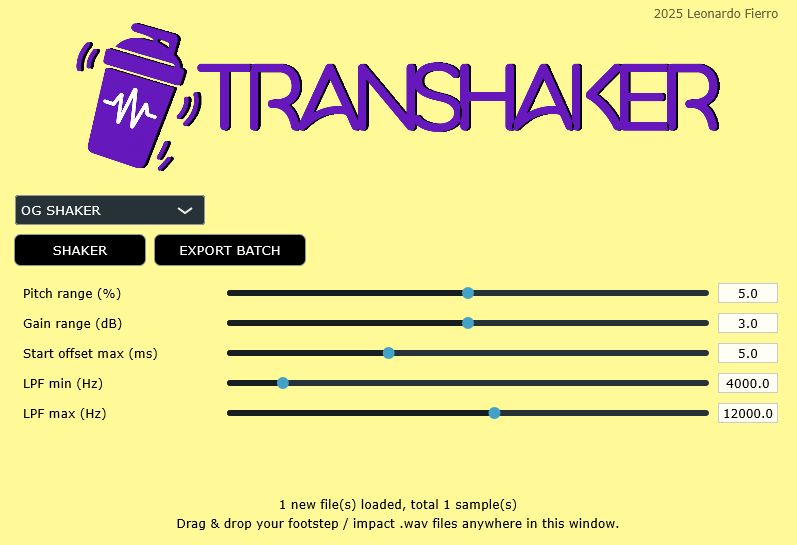

# 🥁😵💫 Transhaker (aka Transient Shaker) 
*A JUCE-based tiny tool for procedural transients variation generation. Oriented for game audio design.*

Repetitive transients used as sound effects (footsteps, gunshots, UI clicks) kill realism fast. **Transhaker** procedurally generates natural variations from any one-shot sound effect.

---

## 🎯 Overview
**Transhaker** is a standalone audio tool built with JUCE that generates natural-sounding variations of one-shot sound effects typically used in game audio, e.g. footsteps, crashes, impacts, gunshots, knocks, or any others transients.

It supports two distinct processing modes:

| Mode | Description |
|------|--------------|
| 🧂 **OG Shaker** | Classic transient randomization: pitch, gain, start offset, and low-pass filtering. |
| 💜 **Velvet Shaker** | Based on *velvet noise decorrelation* from [Fagerström et al., DAFx20in21](#-reference), creating subtle phase and timing microvariations for more organic results. |

The goal of this mini project is to create a lightweight standalone tool with a fast and intuitive way to produce multiple believable variations from a single input sound, ready for use in FMOD, Wwise, or Unity.

---

## ✨ Features
| Category | Description |
|-----------|-------------|
| 🎚 Randomization | Each playback varies in **gain**, **pitch**, **transient start offset**, and **low-pass filtering** |
| ⚡ Real-time preview | Click **SHAKER** to instantly audition randomized versions |
| 🧠 Dual processing modes | Switch between *OG SHAKER* (classic) and *VELVET SHAKER* (velvet noise decorrelation) |
| 📁 Drag & drop import | Drop any `.wav` file (or multiple) into the window to load them into the sample pool |
| 📦 Batch export | Generate 20 randomized variations offline with **EXPORT BATCH** — saved as individual `.wav` files |
| 🧠 Built for pipelines | Produces consistent variation assets for middleware (FMOD, Wwise) or procedural playback in engines (Unity, Unreal) |

---

## 🧩 Parameters

### OG SHAKER
| Control | Range | Effect |
|----------|--------|--------|
| **Pitch range (%)** | 0–10 | Random ±% pitch shift (resampling) |
| **Gain range (dB)** | 0–6 | Random ± dB volume change |
| **Start offset max (ms)** | 0–15 | Random skip at sample start — simulates slightly different transient attacks |
| **LPF min (Hz)** | 2 000–20 000 | Lower limit for random low-pass cutoff |
| **LPF max (Hz)** | 2 000–20 000 | Upper limit for random low-pass cutoff |

### VELVET SHAKER
| Control | Range | Effect |
|----------|--------|--------|
| **Velvet Strength** | 0.0–0.3 | Mix amount for the decorrelated (velvet noise) component |
| **Delay Range (ms)** | 2–20 | Random delay window for decorrelator taps — higher values create more diffuse texture |

---

## 🛠 Architecture
Transhaker is composed of lightweight JUCE components:

| Class | Role |
|-------|------|
| `SamplePool` | Handles loading and storing of user-imported audio files |
| `VariationPlayer` | Applies real-time randomization and playback |
| `OfflineRenderer` | Renders multiple randomized samples offline and writes to disk |
| `AudioFileWriter` | Utility for 24-bit WAV file export |
| `MainComponent` | Manages UI, parameters, and audio routing |

---

## 🪶 Velvet Noise Decorrelator
The *Velvet Shaker* mode implements an adaptation of the **velvet noise decorrelation technique** introduced by  
**Jon Fagerström, Sebastian Gäbel, and Vesa Välimäki**,  
in their paper:

> *T. Fagerström, S. Gäbel, and V. Välimäki, “One-to-Many: Augmenting Audio Datasets with Velvet Noise Decorrelators,” in Proc. of the 24th International Conference on Digital Audio Effects (DAFx20in21), Vienna, Austria, 2021.*

The method uses sparse sequences of ±1 impulses (velvet noise) with randomized delay distributions to produce perceptually decorrelated versions of the same sound, maintaining timbral identity while introducing natural micro-differences — ideal for procedural asset augmentation and dataset expansion.

For reference, the original MATLAB implementation by the authors is available at:  
👉 [https://github.com/Ion3rik/one2many](https://github.com/Ion3rik/one2many)

---

## 🚀 Building

### Requirements
- **JUCE 7** or newer  
- **Visual Studio 2022** (Windows) or Xcode (macOS)  
- C++17 enabled  

### Build steps
1. Open the project’s `.jucer` file in **Projucer**.
2. Add all source files if not already present (`Source/*.h` and `.cpp`).
3. Set exporter to *Visual Studio 2022* (or your IDE of choice).
4. Click *Save Project and Open in IDE*.
5. Build and run.

---

## 🎧 Usage
1. **Run Transhaker.**
2. **Drag & drop** one or more `.wav` files (mono or stereo).
3. Adjust parameters.
4. Press **SHAKER** → hear a random variation live.
5. Press **EXPORT BATCH** → choose a folder → get 20 rendered variations.

## Next steps
* fix missing titlebar/taskbar icon loading
* add batch size selection
* add time-stretching features
* add stereo widening / random pan
* add UI oscilloscope / waveform preview of the chosen sample 
* add JSON preset export for game engines
* add loudness normalization (dBFS)

---

2025 - Leonardo Fierro - Built with JUCE and good transient energy.
