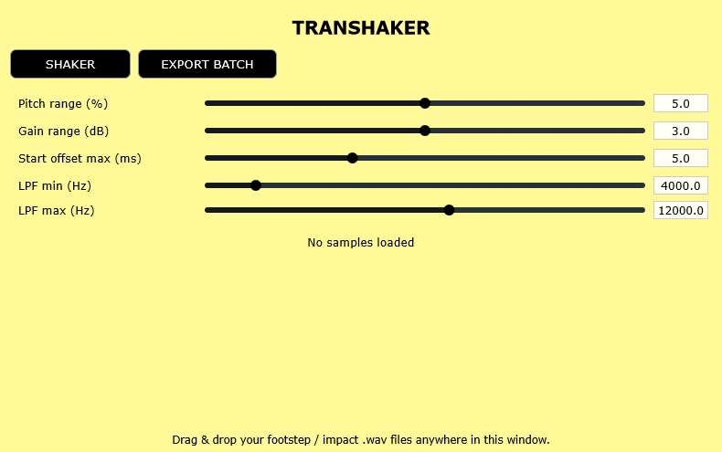

# Transhaker (aka Transient Shaker)
A JUCE-based tiny tool that spits variations of your transient sounds.

Repetitive transients used as sound effects (footsteps, gunshots, UI clicks) kill realism fast. Why not add some variation to them?

The scope of this miniproject is to mimic runtime randomization logic common in middleware (FMOD/Wwise random containers), but in a lightweight standalone tool for designers.

## How it works
Drag in a set of similar one-shots → generate infinite subtle variations with randomized pitch, gain, filtering, and micro offset.

* Pitch range (%) - random ±X% playback rate per trigger
* Gain range (dB) - random ±X dB gain per trigger
* Start offset max (ms)	- random skip of up to X ms from start
* LPF min (Hz) - lower bound of random low-pass cutoff
* LPF max (Hz) - upper bound of random low-pass cutoff

## Next steps
* add time-stretching features
* add stereo widening / random pan
* add UI oscilloscope / waveform preview of the chosen sample 
* add JSON preset export for game engines
* add loudness normalization (dBFS)
